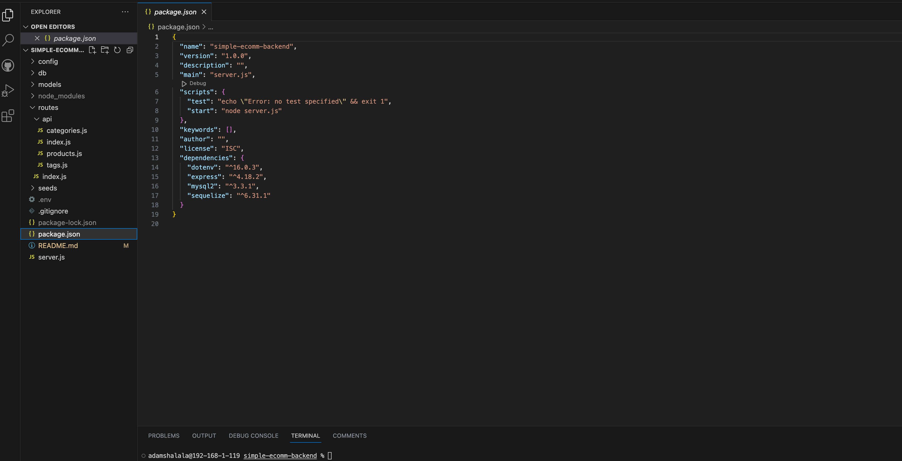
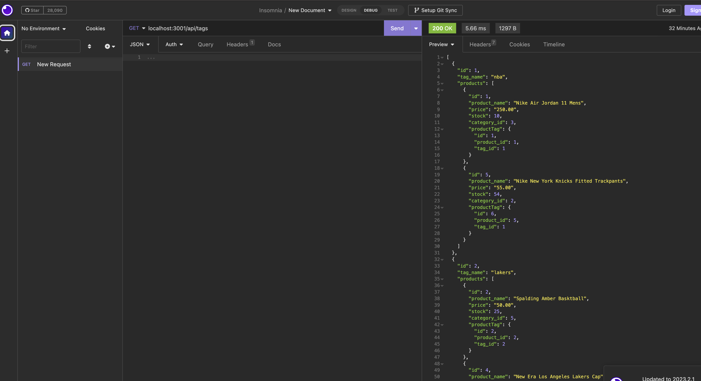

# Simple Ecomm Backend

# Link to Video Demo of App

https://drive.google.com/file/d/1J4pKO3p9FYoVCm8DXY_2NlAuozc6v9Yq/view

## Description

- Create a simple Ecomm Database with products , tags and catergories.

### Why
- This project was built to practice my sequilize and  mysql skills
### Problem this app solves
- It creates a relational db using api calls via express
### Learnings
- Learnt how to put all these frameworks i have learnt all together in a practical solution that mimicks real world tech-stacks and environments.

## Table of contents:

- [Installation](#installation)
- [Usage](#usage)
- [Contributing](#contributing)
- [Tests](#tests)
- [License](#license)
- [Questions](#questions)

## Installation

- Code editor (e.g. Visual Studio Code) Modern web browser (e.g. Google Chrome, Mozilla Firefox)

## Usage

Run in VScode, in the CLI npm install all the packages. Then open the db folerd in myswl to create the db and then seeds the db (pptionally) using node seeds/seed.js

### Screenshots 

## Contributing

### To contribute to our project, please follow these steps:

- Fork the repository and create a new branch for your changes.
- Make your changes and commit them to your branch.
- Push your changes to your forked repository.
- Submit a pull request to our repository.
- Please provide a clear and descriptive title for your pull request, along with a detailed description of the changes you have made. We also ask that you include any relevant tests or documentation updates with your changes.

## Tests

None were used for this project

## License

This project is licensed under the mit license.

## Questions

If you have any questions or feedback on the project, feel free to reach out to me at:

- Email: ashalala93@gmail.com
- GitHub: https://github.com/supershalala

